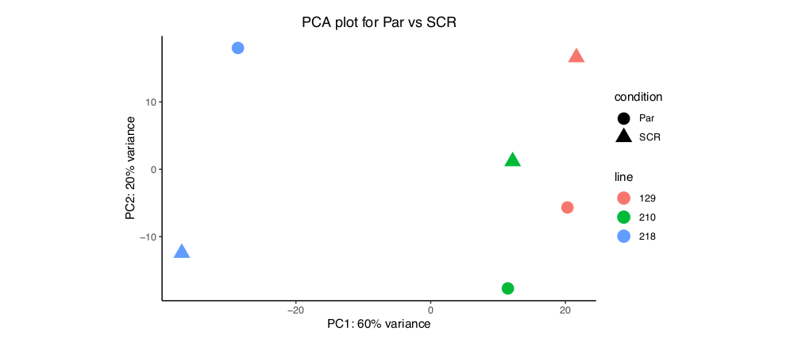
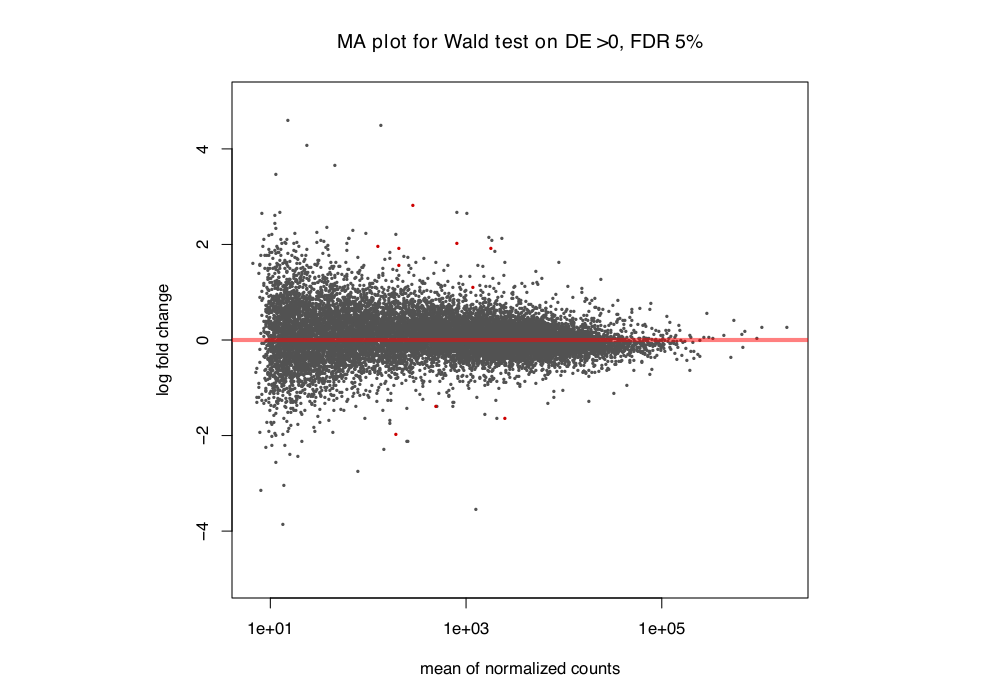
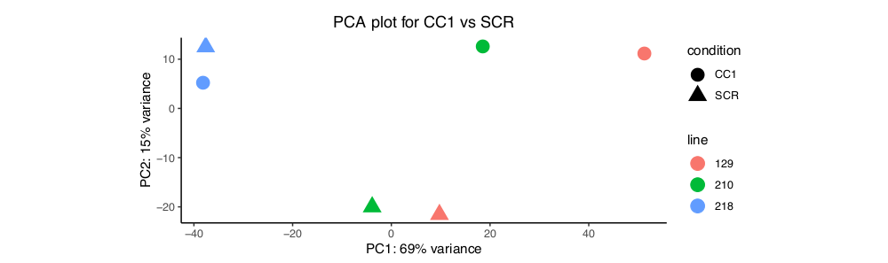
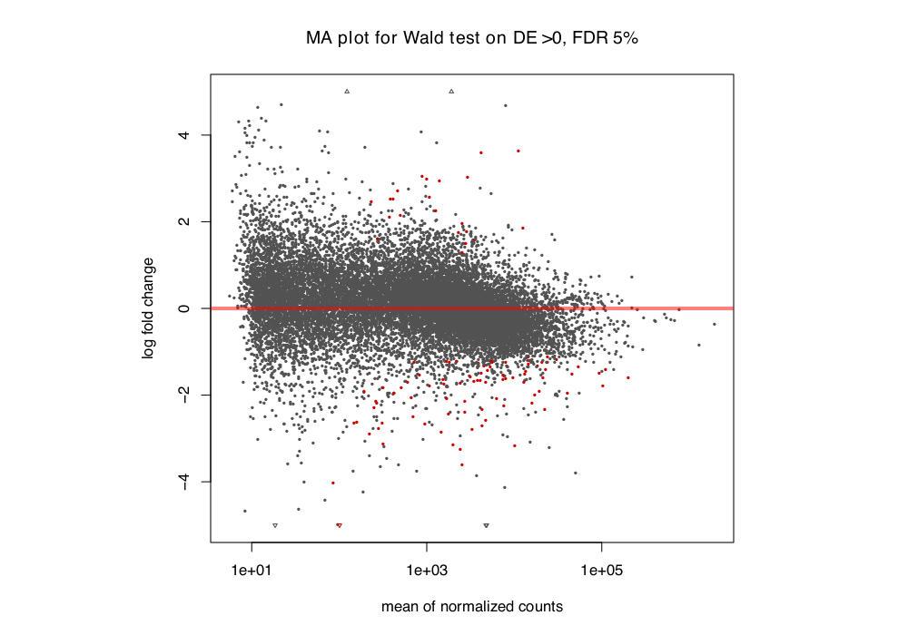
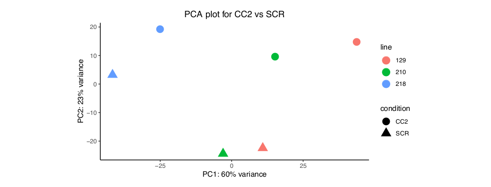
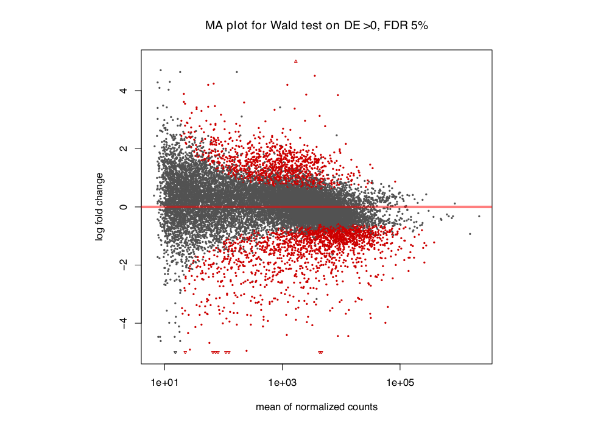

# Results for organoid lentivirus pilot

## Preliminary gene expression analysis

### Parental line (Par) vs scramble (SCR)

__PCA:__


__Results summary from DESeq2:__
```
> summary(res)

out of 18236 with nonzero total read count
adjusted p-value < 0.05
LFC > 0 (up)       : 7, 0.038%
LFC < 0 (down)     : 3, 0.016%
outliers [1]       : 0, 0%
low counts [2]     : 3536, 19%
```

__LFC vs mean norm counts (MA plot):__


### CC1 treatment vs SCR

__PCA:__


__Results summary from DESeq2:__
```
> summary(res)

out of 17791 with nonzero total read count
adjusted p-value < 0.05
LFC > 0 (up)       : 23, 0.13%
LFC < 0 (down)     : 88, 0.49%
outliers [1]       : 0, 0%
low counts [2]     : 3794, 21%
```

__LFC vs mean norm counts (MA plot):__


### CC2 treatment vs SCR

__PCA:__


__Results summary from DESeq2:__
```
out of 18064 with nonzero total read count
adjusted p-value < 0.05
LFC > 0 (up)       : 1150, 6.4%
LFC < 0 (down)     : 1811, 10%
outliers [1]       : 0, 0%
low counts [2]     : 1401, 7.8%
```

__LFC vs mean norm counts (MA plot):__


## Preliminary transcript expression analysis

### Summary of DE results
```
Par vs SCR
out of 72303 with nonzero total read count
adjusted p-value < 0.1
LFC > 0 (up)       : 107, 0.15%
LFC < 0 (down)     : 101, 0.14%
outliers [1]       : 0, 0%
low counts [2]     : 0, 0%
(mean count < 2)

CC1 vs SCR
out of 72303 with nonzero total read count
adjusted p-value < 0.1
LFC > 0 (up)       : 465, 0.64%
LFC < 0 (down)     : 249, 0.34%
outliers [1]       : 0, 0%
low counts [2]     : 14018, 19%
(mean count < 9)

CC2 vs SCR
out of 72303 with nonzero total read count
adjusted p-value < 0.1
LFC > 0 (up)       : 1728, 2.4%
LFC < 0 (down)     : 902, 1.2%
outliers [1]       : 0, 0%
low counts [2]     : 26634, 37%
(mean count < 19)
```

### Rank of target transcripts
```
colca1_tx <- c("ENST00000620864.1", "ENST00000540738.3", "ENST00000355430.4", "ENST00000532918.4", "ENST00000526150.1")
colca2_tx <- c("ENST00000398035.6", "ENST00000526216.1", "ENST00000614153.4", "ENST00000610738.5", "ENST00000638573.1", "ENST00000528846.5", "ENST00000639470.1")

> colca1_rnk
$Par
[1] 60486    NA 60485    NA    NA
$CC1
[1] 51568    NA 37498    NA    NA
$CC2
[1]  4163    NA 31496    NA    NA

> colca2_rnk
$Par
[1] 65134 65135    NA    NA    NA    NA    NA
$CC1
[1] 48575 28353    NA    NA    NA    NA    NA
$CC2
[1] 37471 39830    NA    NA    NA    NA    NA
```
